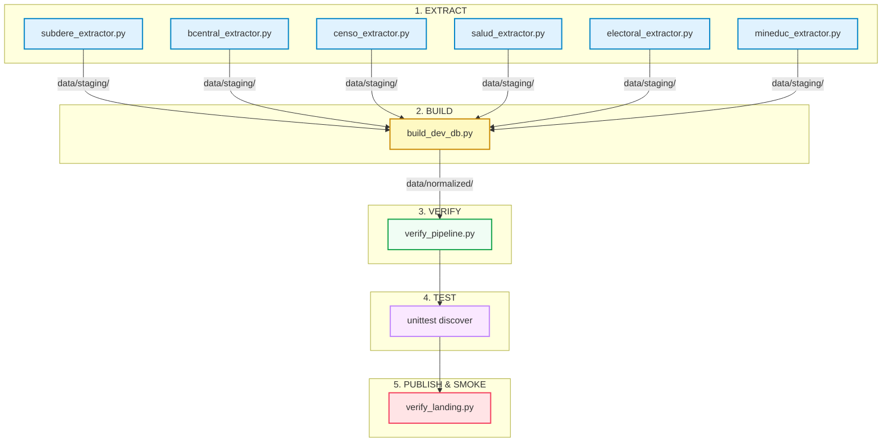

# 🇨🇱 chile-hub

[](https://github.com/cortega26/chile-hub/actions)
[](https://creativecommons.org/licenses/by/4.0/)
[]()
[]()
[](https://cortega26.github.io/chile-hub/)

Capas de datos chilenas curadas, normalizadas, reproducibles y fáciles de consumir en una sola línea de código, obtenidas a partir de fuentes oficiales chilenas bajo licencias libres o legalmente reutilizables.

> [!NOTE]
> `chile-hub` no busca "tener todos los datos de Chile". Busca reducir drásticamente el costo técnico de encontrar, limpiar, validar, cruzar y consumir datasets geográficos, demográficos, electorales y económicos críticos de Chile.

---

## Tabla de Contenidos
- [Qué problema resuelve](#qué-problema-resuelve)
- [Filosofía del proyecto](#filosofía-del-proyecto)
- [Arquitectura del Pipeline](#arquitectura-del-pipeline)
- [Relaciones de Datos (CUT Codes)](#relaciones-de-datos-cut-codes)
- [Capas de Datos Incluidas (10 Capas)](#capas-de-datos-incluidas-10-capas)
- [Formatos y Outputs Generados](#formatos-y-outputs-generados)
- [Uso Rápido](#uso-rápido)
  - [DuckDB](#duckdb)
  - [Python con Polars](#python-con-polars)
  - [Python Helper (ChileHub API)](#python-helper-chilehub-api)
  - [Guía de la CLI Local](#guía-de-la-cli-local)
- [Desarrollo y Ejecución Local](#desarrollo-y-ejecución-local)
- [Fuentes, Licencias y Reuso](#fuentes-licencias-y-reuso)
- [Próximo Foco](#próximo-foco)

---

## Qué problema resuelve

Trabajar con datos públicos de Chile suele implicar los mismos obstáculos repetitivos:
- ❌ **Enlaces rotos** o APIs inconsistentes y propensas a caídas.
- ❌ **Planillas Excel deformes**, con celdas combinadas y formatos incompatibles con código de producción.
- ❌ **Códigos territoriales (CUT) inconsistentes** (p. ej., pérdida de ceros a la izquierda al leerlos como números enteros).
- ❌ **Nombres de comunas difíciles de cruzar** debido a diferencias en acentos, mayúsculas o la letra `ñ` (ej. *Cochamó* vs *Cochamo*, *Ñuñoa* vs *Nunoa*).
- ❌ **Falta de trazabilidad y documentación** sobre la vigencia, origen legal y validez del dato.

`chile-hub` soluciona esto proveyendo un flujo automatizado de extracción, normalización e integridad de datos para entregar **tablas listas para análisis y desarrollo** desde el día uno.

---

## Filosofía del proyecto

### Sí es
- **Un hub de capas estructuradas**: Limpias, consistentes y listas para cruces inmediatos.
- **Un pipeline reproducible**: Código Python e infraestructura en GitHub Actions para compilar los artefactos de forma idéntica en local o en CI/CD.
- **Un catálogo centrado en la calidad**: Con auditorías automáticas de frescura (`freshness`), cobertura (`coverage`), alertas de drift y degradación operativa.

### No es
- Un reemplazo de las plataformas estatales de datos abiertos.
- Un directorio infinito de enlaces externos sin procesar.
- Una promesa de cobertura de todos los microdatos del sector público chileno.
- Un servicio de API compleja obligatoria para el consumo simple de los datos.

---

## Arquitectura del Pipeline

El proyecto está diseñado bajo un pipeline lineal y determinista que asegura que ningún dato corrupto llegue a producción:



> [!IMPORTANT]
> **Invariante Crítica:** El pipeline falla de forma ruidosa si una regla de negocio se rompe. Si la cardinalidad de comunas no es exactamente 346, o si los códigos territoriales pierden el formato de texto (`str`), el build se cancela de inmediato para proteger la integridad de los consumidores.

---

## Relaciones de Datos (CUT Codes)

El valor fundamental de `chile-hub` es que todas sus capas geográficas, demográficas, de salud, educación y electorales se vinculan jerárquicamente a través de los **Códigos Únicos Territoriales (CUT)** definidos por la Subsecretaría de Desarrollo Regional (SUBDERE) y el Instituto Nacional de Estadísticas (INE).


---

## Capas de Datos Incluidas (10 Capas)

A continuación se detallan las 10 capas procesadas actualmente por el hub:

| Capa | Registros | Origen / Fuente | Licencia | Frecuencia | Descripción |
| :--- | :--- | :--- | :--- | :--- | :--- |
| **`regiones`** | 16 | BCN ArcGIS | CC BY | Estable | Regiones político-administrativas con códigos CUT |
| **`provincias`** | 56 | BCN ArcGIS | CC BY | Estable | Provincias chilenas asociadas a su región y código CUT |
| **`comunas`** | 346 | BCN ArcGIS | CC BY | Estable | Comunas de Chile con nombres oficiales y versiones limpias para joins |
| **`comunas_enriquecidas`** | 346 | BCN + INE | CC BY | Estable | Comunas enriquecidas con coordenadas de cabecera y población |
| **`indicadores`** | Serie | BCCh / mindicador.cl | Libre con cita | Diaria | Serie de indicadores diarios (UF, Dólar, Euro, UTM, IPC) |
| **`censo_comunal`** | 346 | INE (Censo 2024) | CC BY 4.0 | Decenal | Demografía por sexo y 5 grandes tramos de edad |
| **`censo_hogares_viviendas`** | 346 | INE (Censo 2024) | CC BY 4.0 | Decenal | Viviendas (particulares/colectivas), hogares y promedio de personas |
| **`establecimientos_salud`** | ~5.600 | MINSAL / datos.gob.cl | CC0 | Mensual | Directorio nacional de recintos de salud con urgencia y coordenadas |
| **`distritos_electorales`** | 346 | BCN / Ley 20.840 | CC0 | Estable | Mapeo de comunas a distritos de diputados y circunscripciones del Senado |
| **`establecimientos_educacionales`**| ~12.900 | MINEDUC | CC BY 3.0 CL | Anual | Directorio de colegios/liceos vigentes con código RBD y coordenadas |

---

### Detalles del Schema por Capa

<details>
<summary><b>1. Capa: regiones</b></summary>

| Columna | Tipo | Descripción | Ejemplo |
| :--- | :--- | :--- | :--- |
| `codigo_region` | `VARCHAR` | Código CUT de la región (2 chars) | `"01"` |
| `nombre_region` | `VARCHAR` | Nombre oficial de la región | `"Tarapacá"` |
</details>

<details>
<summary><b>2. Capa: provincias</b></summary>

| Columna | Tipo | Descripción | Ejemplo |
| :--- | :--- | :--- | :--- |
| `codigo_region` | `VARCHAR` | Código CUT de la región (2 chars) | `"01"` |
| `nombre_region` | `VARCHAR` | Nombre oficial de la región | `"Tarapacá"` |
| `codigo_provincia` | `VARCHAR` | Código CUT de la provincia (3 chars) | `"011"` |
| `nombre_provincia` | `VARCHAR` | Nombre oficial de la provincia | `"Iquique"` |
</details>

<details>
<summary><b>3. Capa: comunas</b></summary>

| Columna | Tipo | Descripción | Ejemplo |
| :--- | :--- | :--- | :--- |
| `codigo_comuna` | `VARCHAR` | Código CUT de la comuna (5 chars) | `"01101"` |
| `nombre_comuna` | `VARCHAR` | Nombre oficial normalizado con acentos | `"Iquique"` |
| `nombre_comuna_clean` | `VARCHAR` | Nombre en minúsculas, sin tildes ni `ñ` | `"iquique"` |
| `codigo_provincia` | `VARCHAR` | Código CUT de la provincia (3 chars) | `"011"` |
| `nombre_provincia` | `VARCHAR` | Nombre oficial de la provincia | `"Iquique"` |
| `codigo_region` | `VARCHAR` | Código CUT de la región (2 chars) | `"01"` |
| `nombre_region` | `VARCHAR` | Nombre oficial de la región | `"Tarapacá"` |
| `latitud_cabecera` | `DOUBLE` | Latitud de la capital comunal | `-20.2138` |
| `longitud_cabecera` | `DOUBLE` | Longitud de la capital comunal | `-70.1508` |
| `poblacion_estimada` | `INTEGER` | Proyección o referencia de población | `223400` |
</details>

<details>
<summary><b>4. Capa: comunas_enriquecidas</b></summary>

| Columna | Tipo | Descripción | Ejemplo |
| :--- | :--- | :--- | :--- |
| `codigo_comuna` | `VARCHAR` | Código CUT de la comuna (5 chars) | `"01101"` |
| `nombre_comuna` | `VARCHAR` | Nombre oficial normalizado | `"Iquique"` |
| `nombre_comuna_clean` | `VARCHAR` | Nombre sin acentos para búsquedas indexadas | `"iquique"` |
| `codigo_provincia` | `VARCHAR` | Código CUT de la provincia (3 chars) | `"011"` |
| `nombre_provincia` | `VARCHAR` | Nombre oficial de la provincia | `"Iquique"` |
| `codigo_region` | `VARCHAR` | Código CUT de la región (2 chars) | `"01"` |
| `nombre_region` | `VARCHAR` | Nombre oficial de la región | `"Tarapacá"` |
| `latitud_cabecera` | `DOUBLE` | Latitud de la capital comunal | `-20.2138` |
| `longitud_cabecera` | `DOUBLE` | Longitud de la capital comunal | `-70.1508` |
| `poblacion_estimada` | `INTEGER` | Población estimada INE (base Censo) | `223400` |
</details>

<details>
<summary><b>5. Capa: indicadores</b></summary>

| Columna | Tipo | Descripción | Ejemplo |
| :--- | :--- | :--- | :--- |
| `fecha` | `DATE` | Fecha de aplicación (YYYY-MM-DD) | `2026-05-30` |
| `codigo_indicador` | `VARCHAR` | Identificador corto (`uf`, `dolar`, `utm`, `euro`, `ipc`) | `"uf"` |
| `valor` | `DOUBLE` | Valor del indicador | `39420.50` |
</details>

<details>
<summary><b>6. Capa: censo_comunal</b></summary>

| Columna | Tipo | Descripción | Ejemplo |
| :--- | :--- | :--- | :--- |
| `codigo_region` | `VARCHAR` | Código CUT de la región (2 chars) | `"01"` |
| `nombre_region` | `VARCHAR` | Nombre oficial de la región | `"Tarapacá"` |
| `codigo_provincia` | `VARCHAR` | Código CUT de la provincia (3 chars) | `"011"` |
| `nombre_provincia` | `VARCHAR` | Nombre oficial de la provincia | `"Iquique"` |
| `codigo_comuna` | `VARCHAR` | Código CUT de la comuna (5 chars) | `"01101"` |
| `nombre_comuna` | `VARCHAR` | Nombre oficial de la comuna | `"Iquique"` |
| `poblacion_censada` | `INTEGER` | Población total censada | `223400` |
| `hombres` | `INTEGER` | Población masculina censada | `111200` |
| `mujeres` | `INTEGER` | Población femenina censada | `112200` |
| `razon_hombre_mujer` | `DOUBLE` | Razón de masculinidad (hombres por 100 mujeres)| `99.11` |
| `poblacion_0_14` | `INTEGER` | Población de 0 a 14 años | `45000` |
| `poblacion_15_29` | `INTEGER` | Población de 15 a 29 años | `50000` |
| `poblacion_30_44` | `INTEGER` | Población de 30 a 44 años | `52000` |
| `poblacion_45_64` | `INTEGER` | Población de 45 a 64 años | `48000` |
| `poblacion_65_mas` | `INTEGER` | Población de 65 años o más | `28400` |
</details>

<details>
<summary><b>7. Capa: censo_hogares_viviendas</b></summary>

| Columna | Tipo | Descripción | Ejemplo |
| :--- | :--- | :--- | :--- |
| `codigo_region` | `VARCHAR` | Código CUT de la región (2 chars) | `"01"` |
| `nombre_region` | `VARCHAR` | Nombre oficial de la región | `"Tarapacá"` |
| `codigo_provincia` | `VARCHAR` | Código CUT de la provincia (3 chars) | `"011"` |
| `nombre_provincia` | `VARCHAR` | Nombre oficial de la provincia | `"Iquique"` |
| `codigo_comuna` | `VARCHAR` | Código CUT de la comuna (5 chars) | `"01101"` |
| `nombre_comuna` | `VARCHAR` | Nombre oficial de la comuna | `"Iquique"` |
| `viviendas_censadas` | `INTEGER` | Total de viviendas censadas | `85000` |
| `viviendas_particulares_ocupadas` | `INTEGER` | Viviendas particulares ocupadas | `75000` |
| `viviendas_particulares_desocupadas`| `INTEGER` | Viviendas particulares desocupadas | `9800` |
| `viviendas_colectivas` | `INTEGER` | Viviendas colectivas (hoteles, cárceles, etc.) | `200` |
| `hogares_censados` | `INTEGER` | Total de hogares censados | `73000` |
| `promedio_personas_hogar` | `DOUBLE` | Promedio de personas por hogar | `3.06` |
</details>

<details>
<summary><b>8. Capa: establecimientos_salud</b></summary>

| Columna | Tipo | Descripción | Ejemplo |
| :--- | :--- | :--- | :--- |
| `codigo_establecimiento` | `VARCHAR` | Código único de establecimiento | `"101101"` |
| `nombre_establecimiento` | `VARCHAR` | Nombre oficial del establecimiento | `"Hospital Dr. Ernesto Torres Galdames"` |
| `tipo_establecimiento` | `VARCHAR` | Clasificación del establecimiento | `"Hospital"` |
| `dependencia_administrativa` | `VARCHAR` | Dependencia o sostenedor administrativo | `"Servicio de Salud Tarapacá"` |
| `nivel_atencion` | `VARCHAR` | Nivel de complejidad / atención | `"Alta Complejidad"` |
| `codigo_region` | `VARCHAR` | Código CUT de la región (2 chars) | `"01"` |
| `nombre_region` | `VARCHAR` | Nombre oficial de la región | `"Tarapacá"` |
| `codigo_comuna` | `VARCHAR` | Código CUT de la comuna (5 chars) | `"01101"` |
| `nombre_comuna` | `VARCHAR` | Nombre oficial de la comuna | `"Iquique"` |
| `tiene_servicio_urgencia` | `VARCHAR` | Indica si cuenta con urgencias (`"SI"`/`"NO"`) | `"SI"` |
| `tipo_urgencia` | `VARCHAR` | Tipo de urgencia si corresponde | `"SAPU"` |
| `latitud` | `DOUBLE` | Latitud del establecimiento | `-20.2214` |
| `longitud` | `DOUBLE` | Longitud del establecimiento | `-70.1425` |
| `estado_funcionamiento` | `VARCHAR` | Estado actual de funcionamiento | `"Vigente"` |
</details>

<details>
<summary><b>9. Capa: distritos_electorales</b></summary>

| Columna | Tipo | Descripción | Ejemplo |
| :--- | :--- | :--- | :--- |
| `codigo_comuna` | `VARCHAR` | Código CUT de la comuna (5 chars) | `"13114"` |
| `nombre_comuna` | `VARCHAR` | Nombre oficial de la comuna | `"Las Condes"` |
| `distrito_electoral` | `VARCHAR` | Identificador / número del distrito electoral | `"11"` |
| `circunscripcion_senatorial` | `VARCHAR` | Identificador / número de la circunscripción senatorial | `"7"` |
</details>

<details>
<summary><b>10. Capa: establecimientos_educacionales</b></summary>

| Columna | Tipo | Descripción | Ejemplo |
| :--- | :--- | :--- | :--- |
| `rbd` | `VARCHAR` | Rol Base de Datos (ID único de MINEDUC) | `"1"` |
| `dv_rbd` | `VARCHAR` | Dígito verificador del RBD | `"4"` |
| `nombre_establecimiento` | `VARCHAR` | Nombre oficial del establecimiento educativo | `"Liceo Abate Molina"` |
| `codigo_region` | `VARCHAR` | Código CUT de la región (2 chars) | `"07"` |
| `codigo_comuna` | `VARCHAR` | Código CUT de la comuna (5 chars) | `"07101"` |
| `dependencia_administrativa` | `VARCHAR` | Dependencia administrativa (ej. Municipal, SLEP) | `"Municipal"` |
| `latitud` | `DOUBLE` | Latitud del establecimiento | `-35.4264` |
| `longitud` | `DOUBLE` | Longitud del establecimiento | `-71.6548` |
| `estado_funcionamiento` | `VARCHAR` | Estado de funcionamiento del colegio | `"Vigente"` |
</details>

---

## Formatos y Outputs Generados

El compilador genera archivos normalizados en [`data/normalized`](./data/normalized):

*   **Bases de Datos Integrales**:
    *   `chile_data.duckdb` (DuckDB nativo, ideal para analítica a gran escala).
    *   `chile_data.db` (SQLite clásico, idóneo para aplicaciones embebidas).
*   **Archivos de Intercambio**:
    *   `chile_data_latest.xlsx` (Excel multipestaña con formato de texto para códigos territoriales).
    *   Archivos individuales `.parquet` (optimizados para Polars/Pandas) y `.json` por capa.
*   **Metadatos y Calidad**:
    *   `artifact_manifest.json` (Catálogo físico con hashes SHA256 y tamaños).
    *   `hub_health.json` / `hub_health.md` (Reporte de salud operativa del Hub).
    *   `redistribution_report.json` / `.md` (Estado legal de reuso de cada dataset).
    *   `provenance_report.json` / `.md` (Trazabilidad origen: modo live, fallbacks y marcas de tiempo).
    *   `dataset_catalog.json` / `.md` (Catálogo con schemas y ejemplos copiables).
    *   `hub_bundle.json` (Entrypoint unificado para automatización).
    *   `chile-hub-publishable-bundle.zip` (Empaquetado publicable con verificación SHA256 sidecar).

---

## Uso Rápido

### DuckDB
Puedes consultar las capas Parquet directamente desde DuckDB sin descargar nada más:
```sql
-- Consultar el censo por comuna directamente del archivo Parquet
SELECT nombre_comuna, poblacion_censada, hombres, mujeres
FROM 'data/normalized/censo_comunal.parquet'
ORDER BY poblacion_censada DESC
LIMIT 5;

-- Buscar comunas y sus distritos electorales
SELECT c.nombre_comuna, e.distrito_electoral, e.circunscripcion_senatorial
FROM 'data/normalized/comunas.parquet' c
JOIN 'data/normalized/distritos_electorales.parquet' e
  ON c.codigo_comuna = e.codigo_comuna
WHERE c.nombre_region = 'Valparaíso';
```

### Python con Polars
```python
import polars as pl

# Lectura directa y rápida
df_comunas = pl.read_parquet("data/normalized/comunas.parquet")
df_censo = pl.read_parquet("data/normalized/censo_comunal.parquet")

# Cruce de datos territorial garantizado por tipo string en códigos CUT
df_completo = df_comunas.join(df_censo, on="codigo_comuna")
print(df_completo.head())
```

### Python Helper (ChileHub API)
El helper provisto por el proyecto simplifica la inicialización del catálogo técnico:
```python
from src.chile_hub import ChileHub

hub = ChileHub()

# Listar las capas disponibles
print(hub.list_datasets())

# Cargar directamente como DataFrame de Polars
df_salud = hub.load_polars("establecimientos_salud")
```

---

### Guía de la CLI Local

El proyecto expone una CLI rica para administrar y validar el estado del hub. Se organiza según el tipo de tarea:

#### 1. Inspección y Consulta de Datos
| Comando | Descripción |
| :--- | :--- |
| `python -m src.chile_hub list` | Lista los datasets registrados en el hub. |
| `python -m src.chile_hub show [capa]` | Muestra metadatos y schema detallado de una capa. |
| `python -m src.chile_hub path [capa] --output parquet` | Devuelve la ruta física al archivo de salida especificado. |
| `python -m src.chile_hub example [capa] --kind duckdb` | Genera una receta de consumo de código interactivo. |
| `python -m src.chile_hub overview [--format table]` | Muestra el resumen general del build del hub y estado actual. |
| `python -m src.chile_hub snapshot [--format table]` | Muestra un snapshot rápido del estado de los archivos y frescura. |
| `python -m src.chile_hub inventory [--format table]` | Lista los archivos en `data/normalized/` con sus tamaños y hashes. |

#### 2. Calidad, Salud y Auditoría
| Comando | Descripción |
| :--- | :--- |
| `python -m src.chile_hub health [--format table]` | Entrega el reporte consolidado de salud y severidad del hub. |
| `python -m src.chile_hub freshness-audit` | Audita la frescura de los datos contra el reloj actual en vivo. |
| `python -m src.chile_hub runtime-status` | Combina salud persistida y frescura actual recalculada. |
| `python -m src.chile_hub top-issue` | Identifica la capa con mayor degradación o problema operativo. |
| `python -m src.chile_hub drift [--format table]` | Evalúa desvíos, fallbacks activos y regresiones de cobertura. |
| `python -m src.chile_hub status` | Devuelve un JSON ultraliviano del estado operativo para CI o scripts. |

#### 3. Distribución e Integridad
| Comando | Descripción |
| :--- | :--- |
| `python -m src.chile_hub bundle` | Exporta la metadata consolidada de todo el hub en un único JSON. |
| `python -m src.chile_hub packages` | Lista los paquetes comprimidos de exportación generados. |
| `python -m src.chile_hub package` | Devuelve la ruta al paquete ZIP principal de distribución. |
| `python -m src.chile_hub verify-package` | Genera la instrucción para verificar la integridad del bundle ZIP. |
| `python -m src.chile_hub redistribution` | Muestra el reporte legal de reuso y licencias de cada capa. |
| `python -m src.chile_hub provenance` | Lista las URLs de origen exactas y métodos de extracción aplicados. |

---

## Desarrollo y Ejecución Local

### Prerrequisitos de Entorno

Puedes preparar tu entorno automáticamente mediante el `Makefile`:
```bash
# Crear .venv, instalar dependencias y browsers para smoke tests
make bootstrap

# Verificar versión de Python y dependencias críticas
make doctor
```

Si prefieres realizar la instalación manualmente:
```bash
python3 -m venv .venv
source .venv/bin/activate
pip install --upgrade pip
pip install -r requirements.txt
```

### Ejecutar el Pipeline Completo

Para correr todo el ciclo de integración (extracción, compilación, validaciones, tests y smoke-tests de frontend):
```bash
make refresh
```

O corre los comandos por separado si deseas depurar una etapa en particular:
```bash
make extract      # Lanza todos los extractores de src/extractors/
make build        # Compila los artefactos normalizados
make verify       # Ejecuta verify_pipeline.py sobre los outputs
make test         # Ejecuta la suite de pruebas unitarias y contratos de datos
make verify-landing # Smoke tests de la landing page con Playwright en local
```

La suite de pruebas completa puede lanzarse directamente usando:
```bash
./.venv/bin/python -m unittest discover -s tests -v
```

---

## Fuentes, Licencias y Reuso

### Semáforo de Redistribución Pública

Para evitar contingencias legales, `chile-hub` implementa un semáforo de políticas de reuso en su metadata:

*   🟢 **`open-attribution`**: Datos bajo CC BY, CC0 o equivalentes del Estado chileno. Se empaquetan en el ZIP público de forma automática.
*   🟡 **`public-api-review-terms`**: Datos accesibles por API pública pero sin licencia explícita escrita. Se distribuyen tras verificar la naturaleza del origen primario.
*   🔴 **`restricted`**: Datos protegidos por derechos de autor, términos comerciales o la Ley 19.628 de Protección de Datos Personales (SII, SERVEL, etc.). **Nunca se integran al bundle público**.

### Licencia del Proyecto
El código del pipeline y los metadatos construidos se distribuyen bajo la licencia **[CC BY 4.0](https://creativecommons.org/licenses/by/4.0/deed.es)**. Al consumir los datos de este hub, debes atribuir también a las fuentes oficiales correspondientes (BCN, INE, MINSAL, MINEDUC o Banco Central de Chile) según se indica en la ficha de cada capa.

---

## Próximo Foco

El roadmap actual de `chile-hub` prioriza robustecer la estabilidad operacional de las 10 capas activas frente a caídas de APIs, antes de agregar volumen de forma descontrolada. El criterio para crecer exige justificar: dolor de usuario recurrente, valor de cruce con la DPA y bajo costo de mantenimiento. 

*   *La especificación de producto puede revisarse en [docs/product-spec.md](./docs/product-spec.md).*
*   *El estado de la última corrida se documenta dinámicamente en `data/normalized/pipeline_status.md` tras cada build.*
