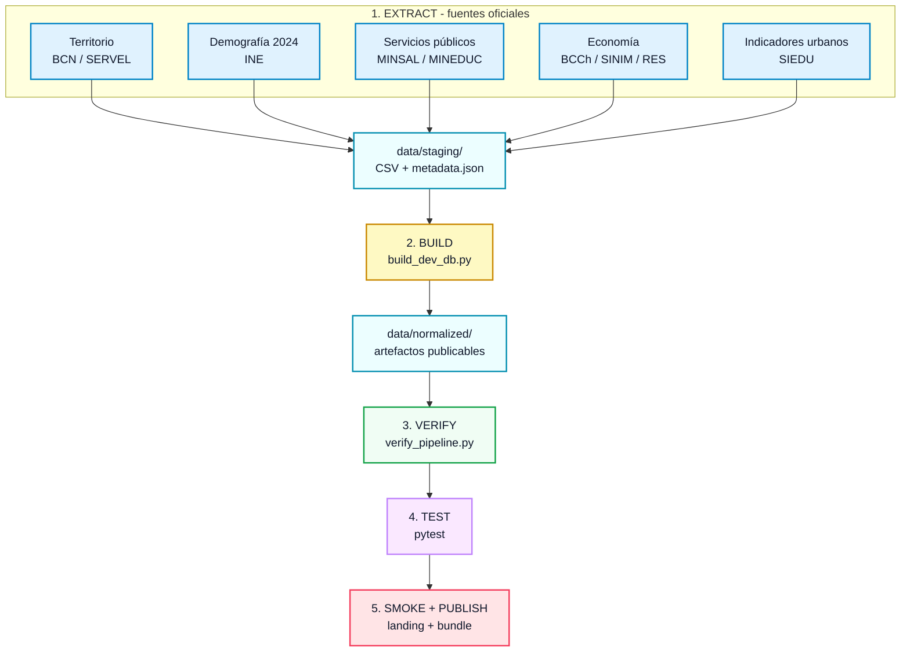
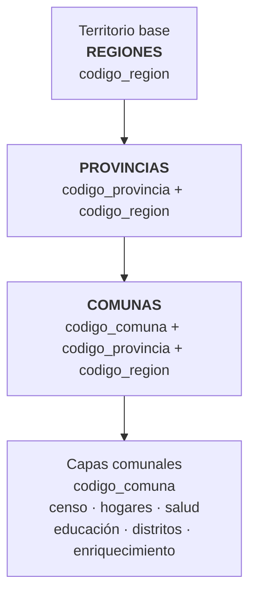

<div align="center">

<h1>
  
  chile-hub
</h1>

<p><strong>Datos públicos de Chile, curados y listos para análisis en una línea de código.</strong></p>
<p><em>El hub de datos abiertos de Chile — parte del ecosistema Tooltician.</em></p>

[](https://tooltician.com)
[](https://github.com/cortega26/chile-hub/actions)
[](https://pypi.org/project/chile-hub/)
[](https://pypi.org/project/chile-hub/)
[](https://tooltician.com/chile-hub/data/normalized/hub_status.json)
[](https://tooltician.com/chile-hub/data/normalized/hub_health.json)
[](LICENSE)
[]()
[]()
<!-- START_DATASET_BADGE -->
[]()
<!-- END_DATASET_BADGE -->
[]()

<p>
  <a href="#-instalar-y-usar-en-segundos">Instalación</a> ·
  <a href="#las-19-capas-de-datos">Capas</a> ·
  <a href="#arquitectura-del-pipeline">Arquitectura</a> ·
  <a href="#cli-de-referencia">CLI</a> ·
  <a href="#fuentes-licencias-y-reúso">Licencias</a>
</p>

</div>

---

## ⚡ Instalar y usar en segundos

```bash
pip install chile-hub
```

```python
from chile_hub import ChileHub

hub = ChileHub()
comunas = hub.load_polars("comunas")          # 346 comunas como DataFrame
indicadores = hub.load_polars("indicadores")  # Serie histórica UF, Dólar, Euro, UTM, IPC

# Cruce territorial garantizado — códigos CUT siempre VARCHAR
censo = hub.load_polars("censo_comunal")
df = comunas.join(censo, on="codigo_comuna")
print(df.head())
```

La primera ejecución descarga automáticamente el bundle validado desde GitHub Releases, verifica su integridad SHA256 y lo deja en cache local. A partir de ahí, todo corre contra el cache. También puedes administrarlo explícitamente:

```bash
chile-hub cache update     # Forzar descarga del bundle más reciente
chile-hub cache status     # Ubicación y estado del cache local
chile-hub cache clear      # Liberar espacio
```

> **Variante para desarrolladores del pipeline:** `pip install chile-hub[pipeline]` agrega DuckDB, Pandas, XlsxWriter y curl_cffi para ejecutar el pipeline completo de extracción y build. La instalación mínima solo incluye Polars, PyArrow, requests y platformdirs — suficiente para consumir datos.

> [!NOTE]
> **chile-hub** no busca "tener todos los datos de Chile". Busca **reducir drásticamente el costo técnico** de encontrar, limpiar, validar, cruzar y consumir datasets geográficos, demográficos, electorales y económicos críticos de Chile.

En la práctica, sirve para responder preguntas comunes sin rehacer limpieza base:

- ¿Cómo cruzo mi base de clientes, escuelas o centros de salud con comunas oficiales sin perder ceros en los códigos?
- ¿Qué comunas concentran población censada, establecimientos públicos o indicadores urbanos?
- ¿Cómo llevo datos oficiales a Polars, DuckDB, SQLite, Excel o CI sin depender de enlaces cambiantes?

---

## ¿Por qué existe?

Trabajar con datos públicos chilenos implica enfrentar los mismos obstáculos una y otra vez:

| ❌ Sin chile-hub | ✅ Con chile-hub |
|:---|:---|
| Enlaces rotos y APIs inconsistentes | Pipeline automatizado con fallbacks y verificación de integridad |
| Planillas Excel deformes con celdas combinadas | Parquet, DuckDB y JSON listos para producción |
| Códigos CUT que pierden ceros al leerse como `int` | CUT garantizados como `VARCHAR` de largo fijo (`"01101"`) |
| Nombres de comunas imposibles de cruzar (_Ñuñoa_ vs _Nunoa_) | Columna `nombre_comuna_clean` normalizada para cruces exactos |
| Cero trazabilidad sobre origen y vigencia del dato | Metadatos con fuente, fecha de extracción, licencia y modo |

chile-hub empaqueta esas decisiones en una capa reproducible: extrae desde fuentes oficiales, normaliza schemas, valida reglas territoriales y publica artefactos listos para consumo local o CI/CD.

---

## ¿Qué entrega chile-hub?

<table>
<tr><td>

**Curado y validado**
Cada capa pasa por validaciones automáticas de integridad referencial, cardinalidad exacta (346 comunas) y formato de códigos territoriales. El pipeline **falla ruidosamente** antes de publicar datos corruptos.

</td><td>

**Cruzable por diseño**
Todos los datasets se vinculan mediante códigos CUT (`codigo_comuna`, `codigo_provincia`, `codigo_region`). Una sola clave une demografía, salud, educación, finanzas municipales, indicadores urbanos y distritos electorales.

</td></tr>
<tr><td>

**Múltiples formatos**
Parquet para analítica de alto rendimiento, DuckDB para consultas SQL locales, SQLite para aplicaciones embebidas, JSON para pipelines y Excel para usuarios de planillas. Todos generados desde la misma fuente.

</td><td>

**Trazabilidad total**
Cada artefacto incluye: fuente original, fecha de extracción, modo (en vivo/respaldo), hash SHA256, licencia y estatus de redistribución. Sabes exactamente qué estás consumiendo.

</td></tr>
<tr><td>

**Una línea de código**
```python
from chile_hub import ChileHub

hub = ChileHub()
df = hub.load_polars("comunas")
```

</td><td>

**CI/CD transparente**
Pipeline determinista en GitHub Actions: extracción → build → verificación → tests → pruebas de humo. Todo reproducible en local con `make refresh`.

</td></tr>
</table>

---

## Las 19 capas de datos

<!-- START_DATASET_TABLE -->

| # | Capa | Registros | Modo | Fuente | Licencia | Actualización |
|:--:|:---|:---|:--:|:---|:---|:--:|
| 1 | **Regiones** | 16 | 🟢 live | BCN ArcGIS | CC BY | — |
| 2 | **Provincias** | 56 | 🟢 live | BCN ArcGIS | CC BY | — |
| 3 | **Comunas** | 346 | 🟢 live | BCN ArcGIS | CC BY | — |
| 4 | **Comunas Enriquecidas** | 346 | 🟢 live | BCN + INE | CC BY | — |
| 5 | **Indicadores Económicos** | Serie histórica | 🟢 live | BCCh / mindicador.cl | Libre c/cita | Diaria |
| 6 | **Censo Comunal 2024** | 346 | 🟢 live | INE | CC BY 4.0 | Decenal |
| 7 | **Censo Hogares y Viviendas** | 346 | 🟢 live | INE | CC BY 4.0 | Decenal |
| 8 | **Establecimientos de Salud** | 5707 | 🟢 live | MINSAL / datos.gob.cl | CC0 | Mensual |
| 9 | **Distritos Electorales** | 346 | 🟢 live | BCN / Ley 20.840 | CC0 | — |
| 10 | **Establecimientos Educacionales** | ~12 898 | 🟢 live | MINEDUC | CC BY 3.0 CL | Anual |
| 11 | **Finanzas Municipales** ⚠️ | 345 (parcial, 345/346) | 🔶 parcial | SINIM / SUBDERE | Revisión términos | Anual |
| 12 | **Resultados Educacionales** | 345 | 🟢 live | MINEDUC | CC BY 3.0 CL | Anual |
| 13 | **Indicadores Urbanos SIEDU** | 6 701 (parcial) | 🟢 live | INE / SIEDU | Datos abiertos INE | Anual |
| 14 | **Perfil Territorial Comunal** | 346 | 🟡 fallback | chile-hub derivado | Fuentes abiertas | Derivada |
| 15 | **Empresas (RES)** | ~1 572 116 | 🟢 live | Min. Economía / datos.gob.cl | CC-BY 3.0 CL | Mensual |
| 16 | **Pobreza Comunal (SAE)** | 3 | 🟡 fallback | MDS / Observatorio Social | Datos abiertos MDS | Bienal/trienal |
| 17 | **Consumo Eléctrico Comunal** | 3 | 🟡 fallback | CNE / Energía Abierta | CC BY | Anual |
| 18 | **Partidos Políticos** | 36 | 🟢 live | Cámara de Diputados | CC BY | Bajo_demanda |
| 19 | **Autoridades Electas** | 205 | 🟢 live | Cámara de Diputados + Senado | CC BY | Bajo_demanda |
| 20 | **Delincuencia Comunal** 🆕 | — | 🔜 próximamente | CEAD / SPD | Revisión términos | — |
| 21 | **Autoridades Locales** 🆕 | — | 🔜 próximamente | Wikipedia | CC BY-SA | — |

> **🟢 live**: datos extraídos directamente desde la fuente oficial en cada ejecución del pipeline.
> **🟡 fallback**: datos servidos desde un respaldo curado mientras se completa la extracción en vivo.
> **🔶 parcial**: cobertura inferior al 50% del universo esperado. Capa candidata, no completa.
> **🔜 próximamente**: capa en carril candidate — extractor implementado, datos no incluidos en el bundle público.
> Para auditar el estado exacto de cada capa: `chile-hub provenance` y `chile-hub health`.

<!-- END_DATASET_TABLE -->

## 🔒 Por qué puedes confiar en estos datos

Cada decisión de ingeniería de este proyecto está diseñada para que **no tengas que
confiar ciegamente**. Los datos vienen con la evidencia que los respalda.

| Pilar | Qué significa | Evidencia auditables |
|:---|:---|:---|
| **Procedencia documentada** | Cada dataset declara su fuente oficial exacta con URL directa al organismo público emisor (BCN, INE, MINEDUC, BCCh, MINSAL, datos.gob.cl). | [`provenance_report.md`](data/normalized/provenance_report.md) — fuente, modo y timestamp por capa |
| **Auditoría legal explícita** | <!-- START_REDISTRIBUTION_SUMMARY -->Licencia, atribución requerida y permiso de redistribución verificados dataset por dataset. **19 de 19 capas** pasan la auditoría (`ready`).<!-- END_REDISTRIBUTION_SUMMARY --> | [`redistribution_report.md`](data/normalized/redistribution_report.md) + [`AGENTS.md §6`](AGENTS.md) |
| **Pipeline que falla con estridencia** | Si una validación falla, el pipeline **aborta** — no publica datos corruptos, no emite advertencias silenciosas. | [`ADR-001`](docs/adr/ADR-001-pipeline-lineal-determinista.md) — fail-loud como decisión de arquitectura |
| **Contratos de esquema verificados** | <!-- START_CONTRACT_COUNT -->21 contratos JSON Schema ([`contracts/datasets/`](contracts/datasets/)) definen columnas esperadas, tipos, claves primarias y cobertura. Se validan **en cada build** automáticamente.<!-- END_CONTRACT_COUNT --> | [`ADR-005`](docs/adr/ADR-005-contratos-esquema-json-schema.md) + `contracts/datasets/*.json` |
| **Salud transparente** | <!-- START_HEALTH_SUMMARY -->Dashboard público con severidad, frescura, cobertura, drift y degradación por dataset. 12 capas `ok`, 7 `warn`, 0 `error`.<!-- END_HEALTH_SUMMARY --> | [`hub_health.md`](data/normalized/hub_health.md) — estado completo actualizado en cada build |
| **Calidad medida y pública** | <!-- START_QUALITY_SUMMARY -->Puntuación compuesta A-F por dataset: **promedio 94.2/100** (18 A, 1 B). Dimensiones: validación, contrato, madurez de fuente, frescura, cobertura, política de reúso.<!-- END_QUALITY_SUMMARY --> | [`dataset_quality.md`](data/normalized/dataset_quality.md) — scorecard completo |

Cada pilar se audita automáticamente en cada ejecución del pipeline. Los reportes se
regeneran en cada build — no son documentos estáticos mantenidos a mano. Para auditar
el estado exacto de cualquier capa:

```bash
chile-hub provenance   # fuente, modo y timestamp por dataset
chile-hub health       # severidad, frescura, drift y cobertura
```

### Respaldo adicional

<!-- START_TEST_COUNT -->
- **664 tests** (`pytest --collect-only`) que validan extracción, contratos e integridad de datos.
<!-- END_TEST_COUNT -->
<!-- START_ADR_COUNT -->
- **8 ADRs** ([`docs/adr/`](docs/adr/)) que documentan cada decisión de arquitectura con su contexto, consecuencias y tradeoffs — no solo el "qué", sino el "por qué".
<!-- END_ADR_COUNT -->
- **Drift monitoreado:** todos los datasets bajo vigilancia de deriva de esquema; cualquier
  cambio en la fuente se detecta y registra ([`drift_report.md`](data/normalized/drift_report.md)).
- **Trazabilidad completa:** cada build registra timestamp, versión de extractor y
  snapshot de entrada en [`provenance_report.md`](data/normalized/provenance_report.md).

> Para una explicación más detallada de la arquitectura y las decisiones de diseño,
> lee el [caso de estudio: cómo está construido chile-hub](docs/case-study-construccion-chile-hub.md).

<details>
<summary><b>Ver schema completo de cada capa</b></summary>

<br>

**1. regiones** — 16 regiones político-administrativas
| Columna | Tipo | Ejemplo |
|:---|:---|:---|
| `codigo_region` | `VARCHAR(2)` | `"01"` |
| `nombre_region` | `VARCHAR` | `"Tarapacá"` |

**2. provincias** — 56 provincias con referencia a su región
| Columna | Tipo | Ejemplo |
|:---|:---|:---|
| `codigo_region` | `VARCHAR(2)` | `"01"` |
| `nombre_region` | `VARCHAR` | `"Tarapacá"` |
| `codigo_provincia` | `VARCHAR(3)` | `"011"` |
| `nombre_provincia` | `VARCHAR` | `"Iquique"` |

**3. comunas** — 346 comunas con nombres oficiales y limpios, coordenadas y población
| Columna | Tipo | Ejemplo |
|:---|:---|:---|
| `codigo_comuna` | `VARCHAR(5)` | `"01101"` |
| `nombre_comuna` | `VARCHAR` | `"Iquique"` |
| `nombre_comuna_clean` | `VARCHAR` | `"iquique"` |
| `codigo_provincia` | `VARCHAR(3)` | `"011"` |
| `codigo_region` | `VARCHAR(2)` | `"01"` |
| `nombre_region` | `VARCHAR` | `"Tarapacá"` |
| `latitud_cabecera` | `DOUBLE` | `-20.2138` |
| `longitud_cabecera` | `DOUBLE` | `-70.1508` |
| `poblacion_estimada` | `INTEGER` | `223400` |

**4. comunas_enriquecidas** — Comunas con coordenadas de cabecera y población estimada INE
| Columna | Tipo | Ejemplo |
|:---|:---|:---|
| `codigo_comuna` | `VARCHAR(5)` | `"01101"` |
| `nombre_comuna` | `VARCHAR` | `"Iquique"` |
| `nombre_comuna_clean` | `VARCHAR` | `"iquique"` |
| `codigo_provincia` | `VARCHAR(3)` | `"011"` |
| `codigo_region` | `VARCHAR(2)` | `"01"` |
| `latitud_cabecera` | `DOUBLE` | `-20.2138` |
| `longitud_cabecera` | `DOUBLE` | `-70.1508` |
| `poblacion_estimada` | `INTEGER` | `223400` |

**5. indicadores** — Serie de indicadores económicos diarios (UF, Dólar, Euro, UTM, IPC)
| Columna | Tipo | Ejemplo |
|:---|:---|:---|
| `fecha` | `DATE` | `2026-05-30` |
| `codigo_indicador` | `VARCHAR` | `"uf"` |
| `valor` | `DOUBLE` | `39420.50` |

**6. censo_comunal** — Población por sexo y 5 tramos de edad para las 346 comunas
| Columna | Tipo | Ejemplo |
|:---|:---|:---|
| `codigo_region` | `VARCHAR(2)` | `"01"` |
| `codigo_provincia` | `VARCHAR(3)` | `"011"` |
| `codigo_comuna` | `VARCHAR(5)` | `"01101"` |
| `nombre_comuna` | `VARCHAR` | `"Iquique"` |
| `poblacion_censada` | `INTEGER` | `223400` |
| `hombres` / `mujeres` | `INTEGER` | `111200` / `112200` |
| `razon_hombre_mujer` | `DOUBLE` | `99.11` |
| `poblacion_0_14` … `poblacion_65_mas` | `INTEGER` | 5 tramos etarios |

**7. censo_hogares_viviendas** — Viviendas, hogares y promedio de personas por hogar
| Columna | Tipo | Ejemplo |
|:---|:---|:---|
| `codigo_comuna` | `VARCHAR(5)` | `"01101"` |
| `viviendas_censadas` | `INTEGER` | `85000` |
| `viviendas_particulares_ocupadas` | `INTEGER` | `75000` |
| `viviendas_colectivas` | `INTEGER` | `200` |
| `hogares_censados` | `INTEGER` | `73000` |
| `promedio_personas_hogar` | `DOUBLE` | `3.06` |

**8. establecimientos_salud** — Directorio nacional de recintos de salud (~5 600)
| Columna | Tipo | Ejemplo |
|:---|:---|:---|
| `codigo_establecimiento` | `VARCHAR` | `"101101"` |
| `nombre_establecimiento` | `VARCHAR` | `"Hospital Dr. Ernesto Torres Galdames"` |
| `tipo_establecimiento` | `VARCHAR` | `"Hospital"` |
| `nivel_atencion` | `VARCHAR` | `"Alta Complejidad"` |
| `codigo_comuna` | `VARCHAR(5)` | `"01101"` |
| `tiene_servicio_urgencia` | `VARCHAR` | `"SI"` / `"NO"` |
| `latitud` / `longitud` | `DOUBLE` | Coordenadas geográficas |
| `estado_funcionamiento` | `VARCHAR` | `"Vigente"` |

**9. distritos_electorales** — Mapeo de comunas a distritos y circunscripciones
| Columna | Tipo | Ejemplo |
|:---|:---|:---|
| `codigo_comuna` | `VARCHAR(5)` | `"13114"` |
| `nombre_comuna` | `VARCHAR` | `"Las Condes"` |
| `distrito_electoral` | `VARCHAR` | `"11"` |
| `circunscripcion_senatorial` | `VARCHAR` | `"7"` |

**10. establecimientos_educacionales** — Directorio de colegios y liceos (~12 900)
| Columna | Tipo | Ejemplo |
|:---|:---|:---|
| `rbd` | `VARCHAR` | `"1"` |
| `dv_rbd` | `VARCHAR` | `"4"` |
| `nombre_establecimiento` | `VARCHAR` | `"Liceo Abate Molina"` |
| `codigo_comuna` | `VARCHAR(5)` | `"07101"` |
| `dependencia_administrativa` | `VARCHAR` | `"Municipal"` |
| `latitud` / `longitud` | `DOUBLE` | Coordenadas geográficas |
| `estado_funcionamiento` | `VARCHAR` | `"Vigente"` |

**11. finanzas_municipales** — Indicadores financieros municipales anuales (⚠️ parcial: 345/346 comunas)
| Columna | Tipo | Ejemplo |
|:---|:---|:---|
| `anio` | `INTEGER` | `2024` |
| `codigo_comuna` | `VARCHAR(5)` | `"13101"` |
| `ingresos_totales` / `gastos_totales` | `DOUBLE` | `245000000000.0` |
| `ingresos_propios_permanentes` | `DOUBLE` | `162000000000.0` |
| `fondo_comun_municipal` | `DOUBLE` | `39000000000.0` |

**12. resultados_educacionales** — Métricas educacionales agregadas por comuna/año
| Columna | Tipo | Ejemplo |
|:---|:---|:---|
| `anio` | `INTEGER` | `2024` |
| `codigo_comuna` | `VARCHAR(5)` | `"13101"` |
| `matricula_total` | `INTEGER` | `122000` |
| `asistencia_promedio` | `DOUBLE` | `86.2` |
| `tasa_aprobacion` / `tasa_retiro` | `DOUBLE` | `91.4` / `4.5` |

**13. indicadores_urbanos_siedu** — Indicadores urbanos en formato largo
| Columna | Tipo | Ejemplo |
|:---|:---|:---|
| `anio` | `INTEGER` | `2024` |
| `codigo_comuna` | `VARCHAR(5)` | `"13101"` |
| `codigo_indicador` | `VARCHAR` | `"siedu_acceso_areas_verdes"` |
| `categoria` | `VARCHAR` | `"Espacio publico"` |
| `valor` / `unidad` | `DOUBLE` / `VARCHAR` | `71.4` / `"porcentaje"` |

**14. perfil_territorial_comunal** — Perfil derivado con una fila por comuna
| Columna | Tipo | Ejemplo |
|:---|:---|:---|
| `codigo_comuna` | `VARCHAR(5)` | `"13101"` |
| `poblacion_censada` | `INTEGER` | `223400` |
| `establecimientos_salud_total` | `INTEGER` | `140` |
| `establecimientos_educacionales_total` | `INTEGER` | `410` |
| `distrito_electoral` | `VARCHAR` | `"10"` |

**15. empresas** — Registro de Empresas y Sociedades (RES) con RUT, razón social, tipo societario y comuna
| Columna | Tipo | Ejemplo |
|:---|:---|:---|
| `rut` | `VARCHAR` | `"76286049-K"` |
| `razon_social` | `VARCHAR` | `"COMERCIALIZADORA EJEMPLO SPA"` |
| `codigo_sociedad` | `VARCHAR` | `"SPA"` |
| `capital` | `INTEGER` | `5000000` |
| `fecha_actuacion` | `DATE` | `2020-06-15` |
| `anio` | `INTEGER` | `2020` |
| `comuna_tributaria` | `VARCHAR` | `"SANTIAGO"` |
| `region_tributaria` | `VARCHAR` | `"13"` |

**16. pobreza_comunal** — Estimaciones de pobreza por ingresos y multidimensional (SAE/CASEN)
| Columna | Tipo | Ejemplo |
|:---|:---|:---|
| `codigo_region` | `VARCHAR(2)` | `"13"` |
| `codigo_comuna` | `VARCHAR(5)` | `"13101"` |
| `nombre_comuna` | `VARCHAR` | `"Santiago"` |
| `anio` | `INTEGER` | `2022` |
| `dimension` | `VARCHAR` | `"ingresos"` / `"multidimensional"` |
| `tasa` | `DOUBLE` | `15.3` |
| `limite_inferior` | `DOUBLE` | `12.1` |
| `limite_superior` | `DOUBLE` | `18.9` |
| `metodologia` | `VARCHAR` | `"SAE"` |
| `fuente` | `VARCHAR` | `"Observatorio Social — MDS"` |

**17. consumo_electrico_comunal** — Consumo eléctrico anual por comuna y tipo de cliente (CNE)
| Columna | Tipo | Ejemplo |
|:---|:---|:---|
| `codigo_region` | `VARCHAR(2)` | `"13"` |
| `codigo_comuna` | `VARCHAR(5)` | `"13101"` |
| `nombre_comuna` | `VARCHAR` | `"Santiago"` |
| `anio` | `INTEGER` | `2023` |
| `tipo_cliente` | `VARCHAR` | `"Residencial"` |
| `consumo_kwh` | `DOUBLE` | `1523400.5` |
| `numero_clientes` | `INTEGER` | `45800` |
| `fuente` | `VARCHAR` | `"CNE — Energía Abierta"` |

**18. partidos_politicos** — Roster de partidos políticos vigentes e históricos (Cámara + SERVEL)
| Columna | Tipo | Ejemplo |
|:---|:---|:---|
| `id_partido` | `VARCHAR` | `"DC"` |
| `nombre` | `VARCHAR` | `"Partido Demócrata Cristiano"` |
| `sigla` | `VARCHAR` | `"DC"` |
| `estado_legal` | `VARCHAR` | `"constituido"` (nulo si no matchea con SERVEL) |
| `fecha_constitucion` | `DATE` | `1988-05-02` |
| `ambito` | `VARCHAR` | `null` (sin fuente que lo provea) |
| `fuente` | `VARCHAR` | `"Cámara de Diputadas y Diputados"` |

**19. autoridades_electas** — Diputados y senadores en ejercicio, con partido y distrito/circunscripción
| Columna | Tipo | Ejemplo |
|:---|:---|:---|
| `id_autoridad` | `VARCHAR` | `"diputado_1009"` |
| `nombre` | `VARCHAR` | `"Jorge Alessandri Vergara"` |
| `cargo` | `VARCHAR` | `"diputado"` / `"senador"` |
| `institucion` | `VARCHAR` | `"Cámara de Diputadas y Diputados"` / `"Senado"` |
| `partido` | `VARCHAR` | `"Unión Demócrata Independiente"` |
| `distrito_electoral` | `VARCHAR` | `"10"` (solo diputados) |
| `circunscripcion_senatorial` | `VARCHAR` | `"3"` (solo senadores) |
| `codigo_region` | `VARCHAR(2)` | `"02"` (solo senadores) |
| `periodo_inicio` / `periodo_fin` | `DATE` | `2026-03-11` / `2030-03-10` |
| `estado_mandato` | `VARCHAR` | `"vigente"` |

**20. delincuencia_comunal** — Casos policiales por comuna (CEAD/SPD) ⚠️ _en carril candidate — datos no incluidos en el bundle público_
| Columna | Tipo | Ejemplo |
|:---|:---|:---|
| `codigo_comuna` | `VARCHAR(5)` | `"13101"` |
| `nombre_comuna` | `VARCHAR` | `"Santiago"` |
| `anio` | `INTEGER` | `2024` |
| `mes` | `INTEGER` | `1` |
| `familia_delito` | `VARCHAR` | `"robos_violentos"` |
| `casos` | `INTEGER` | `245` |

**21. autoridades_locales** — Gobernadores regionales y alcaldes vía Wikipedia (CC-BY-SA) ⚠️ _en carril candidate — datos no incluidos en el bundle público_
| Columna | Tipo | Ejemplo |
|:---|:---|:---|
| `id_autoridad` | `VARCHAR` | `"gobernador_01"` |
| `nombre` | `VARCHAR` | `null` si no hay evidencia clara del titular |
| `cargo` | `VARCHAR` | `"gobernador_regional"` / `"alcalde"` |
| `codigo_region` | `VARCHAR(2)` | `"01"` |
| `codigo_comuna` | `VARCHAR(5)` | `"01101"` (solo alcaldes) |
| `partido` | `VARCHAR` | nulo si no identificado |
| `estado_mandato` | `VARCHAR` | `"vigente"` / `"sin_identificar"` |

</details>

---

## Guía de uso

### Consumir datos (instalación desde PyPI)

```bash
pip install chile-hub
```

```python
from chile_hub import ChileHub

hub = ChileHub()

# Catálogo de capas disponibles
print(hub.list_datasets())

# Cargar cualquier capa como Polars DataFrame
comunas = hub.load_polars("comunas")
censo = hub.load_polars("censo_comunal")
salud = hub.load_polars("establecimientos_salud")

# Cruce garantizado: códigos CUT son VARCHAR, no int
df = comunas.join(censo, on="codigo_comuna")
print(df.head())

# Salud operativa del hub
print(hub.health())
```

La primera ejecución descarga el bundle validado desde GitHub Releases, verifica
su integridad SHA256 y lo deja en cache local. También puedes prepararlo explícitamente:

```bash
chile-hub cache update     # Descargar el bundle más reciente
chile-hub cache status     # Ver ubicación y estado del cache
chile-hub cache clear      # Liberar espacio en disco
```

### Consultas SQL con DuckDB

```sql
-- Top 10 comunas por población censada
SELECT nombre_comuna, poblacion_censada, hombres, mujeres
FROM 'data/normalized/censo_comunal.parquet'
ORDER BY poblacion_censada DESC
LIMIT 10;

-- Cruce territorial: comunas × distritos electorales
SELECT c.nombre_comuna, c.nombre_region,
       e.distrito_electoral, e.circunscripcion_senatorial
FROM 'data/normalized/comunas.parquet' c
JOIN 'data/normalized/distritos_electorales.parquet' e
  ON c.codigo_comuna = e.codigo_comuna
WHERE c.nombre_region = 'Valparaíso';
```

### Usar en scripts y producción

```python
import polars as pl

comunas = pl.read_parquet("data/normalized/comunas.parquet")
censo = pl.read_parquet("data/normalized/censo_comunal.parquet")

# Cruce garantizado: códigos CUT son VARCHAR, no int
df = comunas.join(censo, on="codigo_comuna")
print(df.head())
```

<!-- START_VERSION_PIN_EXAMPLE -->
> **Versionado:** Para entornos productivos, fija la versión exacta en `requirements.txt`
> (revisa el badge de PyPI al inicio de este README para la versión más reciente):
> ```
> chile-hub==1.20.0
> ```
> El bundle de datos se publica con cada release. La API del módulo `ChileHub` sigue
> versionado semántico: cambios de interfaz pública solo en _major releases_.
<!-- END_VERSION_PIN_EXAMPLE -->

### Desarrollo local del pipeline

Si necesitas ejecutar el pipeline de extracción y build en tu máquina:

```bash
git clone https://github.com/cortega26/chile-hub.git
cd chile-hub
make bootstrap          # Crea .venv, instala dependencias + Playwright
make refresh            # extract → build → verify → test → pruebas de humo
```

> Usa `pip install chile-hub[pipeline]` si quieres las dependencias completas del pipeline
> (DuckDB, Pandas, XlsxWriter, curl_cffi) pero sin clonar el repositorio.

### Casos de uso listos para copiar

**1. Ranking comunal con Censo 2024**

```python
from chile_hub import ChileHub

hub = ChileHub()
comunas = hub.load_polars("comunas")
censo = hub.load_polars("censo_comunal")

ranking = (
    comunas.join(censo, on="codigo_comuna")
    .select("codigo_comuna", "nombre_comuna", "nombre_region", "poblacion_censada")
    .sort("poblacion_censada", descending=True)
    .head(10)
)
print(ranking)
```

**2. Últimos indicadores económicos disponibles**

```python
from chile_hub import ChileHub

df = ChileHub().load_polars("indicadores")
ultimos = (
    df.sort("fecha", descending=True)
    .group_by("codigo_indicador")
    .first()
    .select("codigo_indicador", "fecha", "valor")
    .sort("codigo_indicador")
)
print(ultimos)
```

**3. Salud y educación por comuna**

```python
from chile_hub import ChileHub

hub = ChileHub()
salud = hub.load_polars("establecimientos_salud")
educacion = hub.load_polars("establecimientos_educacionales")

salud_por_comuna = salud.group_by("codigo_comuna").len("establecimientos_salud")
educacion_por_comuna = educacion.group_by("codigo_comuna").len("establecimientos_educacionales")

resumen = (
    hub.load_polars("comunas")
    .join(salud_por_comuna, on="codigo_comuna", how="left")
    .join(educacion_por_comuna, on="codigo_comuna", how="left")
    .fill_null(0)
    .select("codigo_comuna", "nombre_comuna", "establecimientos_salud", "establecimientos_educacionales")
)
print(resumen.head())
```

### API Python compacta

| API | Uso |
|:---|:---|
| `ChileHub()` | Inicializa el helper; descarga y verifica el bundle si no hay cache local. |
| `ChileHub(data_dir="data/normalized")` | Usa artefactos locales generados por el pipeline. |
| `hub.list_datasets()` | Lista los nombres canónicos disponibles para `load_polars()`. |
| `hub.load_polars("comunas")` | Carga una capa como `polars.DataFrame` desde Parquet. |
| `hub.summary()` / `hub.summary_table()` | Resume modo de fuente, filas, validación, frescura y warnings. |
| `hub.health()` / `hub.status()` | Reporta salud operativa para personas y CI/CD. |
| `hub.redistribution()` | Expone estado legal de reúso y atribución por dataset. |
| `hub.provenance()` | Muestra fuente, URL, modo de extracción y timestamps. |
| `chile-hub cache update/status/clear` | Administra el cache local del bundle publicado. |

---

## Arquitectura del Pipeline

El pipeline es **lineal, determinista y estricto**: si una validación falla, el build se cancela antes de publicar datos corruptos.



> [!IMPORTANTE]
> **Invariante crítica:** El pipeline aborta si la cardinalidad de comunas ≠ 346, si los códigos CUT pierden el formato `VARCHAR`, o si alguna regla de negocio se rompe. **Nunca** se publican datos corruptos.

<details>
<summary><b>Extractores incluidos en el paso 1</b></summary>

| Dominio | Extractores |
|:---|:---|
| Territorio | `subdere_extractor.py`, `electoral_extractor.py` |
| Demografía | `censo_extractor.py`, `censo_hogares_viviendas_extractor.py`, `pobreza_extractor.py` |
| Servicios públicos | `salud_extractor.py`, `mineduc_establecimientos_extractor.py`, `mineduc_resultados_extractor.py` |
| Economía | `bcentral_extractor.py`, `sinim_finanzas_extractor.py`, `sinim_finanzas_live_extractor.py`, `res_extractor.py`, `consumo_electrico_extractor.py` |
| Indicadores urbanos | `siedu_extractor.py` |
| Política | `partidos_politicos_extractor.py`, `autoridades_electas_extractor.py`, `autoridades_locales_extractor.py` |
| Seguridad (carril `candidate`) | `cead_delincuencia_live_extractor.py` |

> El mapeo autoritativo dataset ↔ extractor vive en
> [`data/dataset_catalog_config.json`](data/dataset_catalog_config.json); esta tabla
> es solo orientativa. Detalle completo en [`AGENTS.md §2`](AGENTS.md).

</details>

---

## Modelo de Datos — Códigos CUT

El valor central de chile-hub es que **todas las capas se vinculan jerárquicamente** mediante los Códigos Únicos Territoriales (CUT) de SUBDERE/INE:



| Grupo | Clave principal | Capas |
|:---|:---|:---|
| Territorio base | `codigo_region`, `codigo_provincia`, `codigo_comuna` | `regiones`, `provincias`, `comunas` |
| Capas comunales | `codigo_comuna` | `comunas_enriquecidas`, `censo_comunal`, `censo_hogares_viviendas`, `establecimientos_salud`, `establecimientos_educacionales`, `distritos_electorales` |
| Series nacionales | `fecha`, `codigo_indicador` | `indicadores` |

<details>
<summary><b>Ver schema completo con PK/FK</b></summary>


</details>

---

## Formatos de salida

Cada ejecución del pipeline genera en `data/normalized/`:

| Tipo | Archivo | Uso |
|:---|:---|:---|
| **Base de datos** | `chile_data.duckdb` | Analítica local de alto rendimiento |
| **Base de datos** | `chile_data.db` | SQLite para aplicaciones embebidas |
| **Intercambio** | `chile_data_latest.xlsx` | Excel multipestaña (códigos CUT como texto) |
| **Intercambio** | `*.parquet` por capa | Polars / Pandas / DuckDB |
| **Intercambio** | `*.json` por capa | Pipelines y automatización |
| **Metadatos** | `artifact_manifest.json` | Catálogo físico con SHA256 y tamaños |
| **Metadatos** | `hub_health.json` / `.md` | Reporte de salud operativa |
| **Metadatos** | `dataset_status.json` | Estado machine-readable por dataset |
| **Metadatos** | `dataset_changelog.json` | Deltas de filas, campos, fuente y validación |
| **Metadatos** | `dataset_catalog.json` / `.md` | Catálogo con schemas y ejemplos |
| **Metadatos** | `redistribution_report.json` / `.md` | Estado legal de reúso por dataset |
| **Metadatos** | `provenance_report.json` / `.md` | Trazabilidad de origen y marcas de tiempo |
| **Bundle** | `chile-hub-publishable-bundle.zip` | Paquete público con verificación SHA256 |

---

## CLI de referencia

El paquete instala el comando `chile-hub` en el `PATH`. Todos los subcomandos
funcionan tanto desde PyPI como desde el entorno de desarrollo.

### Inspección y consulta

| Comando | Descripción |
|:---|:---|
| `chile-hub list` | Lista todos los datasets registrados |
| `chile-hub version` | Muestra la versión instalada del paquete |
| `chile-hub cache status` | Muestra ubicación y estado del cache local |
| `chile-hub cache update` | Descarga y verifica el bundle publicado |
| `chile-hub cache clear` | Elimina el cache local |
| `chile-hub show <capa>` | Schema y metadatos detallados de una capa |
| `chile-hub path <capa> --output parquet` | Ruta física al archivo de una capa |
| `chile-hub example <capa> --kind duckdb` | Receta de consumo lista para copiar y pegar |
| `chile-hub overview` | Resumen general del build y estado actual |
| `chile-hub inventory` | Archivos en `data/normalized/` con tamaños y hashes |
| `chile-hub snapshot` | Snapshot humano y compacto del hub |
| `chile-hub summary` | Resumen breve de datasets |
| `chile-hub search <keyword>` | Busca datasets por keyword, fuente o madurez |
| `chile-hub cross <a> <b>` | Cruza dos datasets por clave territorial común |
| `chile-hub export <capa> --output archivo` | Exporta un dataset a CSV, JSON o Parquet |

### Calidad, salud y auditoría

| Comando | Descripción |
|:---|:---|
| `chile-hub health` | Reporte consolidado de salud del hub |
| `chile-hub freshness-audit` | Auditoría de frescura contra el reloj actual |
| `chile-hub runtime-status` | Salud registrada + vigencia en vivo |
| `chile-hub top-issue` | Capa con mayor degradación operativa |
| `chile-hub drift` | Desvíos, fallbacks activos y regresiones |
| `chile-hub status` | JSON ultraliviano para CI/CD |
| `chile-hub dataset-status` | Estado detallado machine-readable por dataset |
| `chile-hub dataset-changelog` | Cambios entre el build actual y el metadata anterior |
| `chile-hub source-readiness` | Madurez de fuente por dataset |
| `chile-hub dataset-quality` | Puntuación de calidad A-F por dataset |
| `chile-hub check-sources` | Verifica conectividad en vivo con las fuentes oficiales |
| `chile-hub validate <capa>` | Valida un dataset (o un CSV/Parquet propio) contra su schema |

### Distribución e integridad

| Comando | Descripción |
|:---|:---|
| `chile-hub bundle` | Metadata consolidada en un solo JSON |
| `chile-hub redistribution` | Reporte legal de reúso por capa |
| `chile-hub provenance` | URLs de origen y métodos de extracción |
| `chile-hub verify-package` | Instrucción de verificación de integridad del ZIP |
| `chile-hub artifacts` | Artefactos publicables del hub |
| `chile-hub shared-artifacts` | Artefactos compartidos del hub (reportes, manifest) |
| `chile-hub reports` | Lista los reportes compartidos disponibles |
| `chile-hub report <nombre>` | Resuelve la metadata de un reporte compartido |
| `chile-hub packages` | Paquetes publicables del hub |
| `chile-hub package` | Metadata del package principal del hub |

> En entorno de desarrollo, usa `python -m chile_hub` o `python -m src.chile_hub`
> como alternativa al comando `chile-hub` si el paquete no está instalado en modo editable.
> Para el listado completo y siempre actualizado: `chile-hub --help`.

---

## Desarrollo local

Esta sección es para contribuidores que necesitan ejecutar el pipeline completo
de extracción, build y verificación en su máquina. Si solo necesitas consumir
los datos, usa `pip install chile-hub` (ver [Guía de uso](#guía-de-uso)).

```bash
# Entorno
make bootstrap          # Crea .venv, instala dependencias + Playwright
make doctor             # Verifica versión de Python y dependencias críticas

# Pipeline completo
make refresh            # extract → build → verify → test → landing

# Pasos individuales
make extract            # Ejecuta los extractores → data/staging/
make build              # Compila artefactos → data/normalized/
make verify             # Verifica integridad (SHA256, conteos, schema)
make test               # pytest (lee data/normalized/, no corre el pipeline)
make coverage           # pytest + cobertura de src/ (term-missing + coverage.xml)
make verify-landing     # Pruebas de humo de landing page con Playwright

# Tests
./.venv/bin/pytest -v
./.venv/bin/pytest --cov=src --cov-report=term-missing --cov-report=xml
./.venv/bin/pytest tests/test_chile_hub.py::ChileHubTests::test_load_polars -v
```

---

## Fuentes, licencias y reúso

### Semáforo de redistribución

| Color | Estado | Acción |
|:---:|:---|:---|
| 🟢 `open-attribution` | CC BY, CC0 o equivalente | Se incluye en el bundle público |
| 🟡 `public-api-review-terms` | API pública sin licencia explícita | Se distribuye tras verificar el origen primario |
| 🔴 `restricted` | Derechos de autor, Ley 19.628 | **Nunca** se integra al bundle público |

### Licencia del proyecto

El código Python se distribuye bajo **[MIT](LICENSE)**. Los datasets conservan
las licencias, permisos y requisitos de atribución de sus fuentes oficiales.
Consulta [DATA_LICENSES.md](DATA_LICENSES.md), `chile-hub redistribution` y
`chile-hub provenance` antes de redistribuir artefactos derivados.

---

## Próximos pasos

El roadmap actual prioriza crecer en usabilidad y confianza antes que agregar más capas.

| Horizonte | Foco | Resultado esperado |
|:---|:---|:---|
| Now | Ejemplos, notebooks, errores claros y referencia API | Usuarios cargan y cruzan datos sin leer el pipeline completo. |
| Next | Contratos de schema, source readiness y criterios públicos | Contribuidores proponen datasets con reglas claras y verificables. |
| Later | Nuevas capas solo si pasan criterios de inclusión | El catálogo crece sin perder mantenibilidad ni claridad legal. |

> La especificación completa del producto está en [`docs/product-spec.md`](./docs/product-spec.md).
> Los criterios públicos para solicitar nuevas capas están en [`docs/dataset-inclusion-criteria.md`](./docs/dataset-inclusion-criteria.md).
> El estado de la última corrida se documenta en `data/normalized/pipeline_status.md` tras cada build.

---

## ¿Quieres contribuir?

Revisa [`AGENTS.md`](./AGENTS.md) para entender la arquitectura, las reglas no negociables y el flujo de trabajo. El punto de partida rápido es [`SOURCE_OF_TRUTH.md`](./SOURCE_OF_TRUTH.md).

**¿Encontraste un error o tienes un caso de uso?** Abre un [issue](https://github.com/cortega26/chile-hub/issues) — ayuda a priorizar el roadmap.


<div align="center">

**  Hecho con datos públicos chilenos, para quienes construyen sobre Chile.**

<sub>Parte del [ecosistema Tooltician](https://tooltician.com) — datos públicos, interoperables y listos para IA.</sub>

</div>
